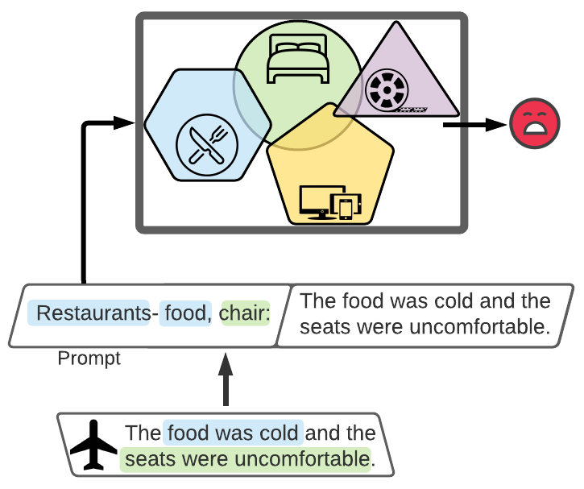

# PADA

### Official code repository for the  paper ["PADA: Example-based Prompt Learning for on-the-fly Adaptation to Unseen Domains"](https://direct.mit.edu/tacl/article/doi/10.1162/tacl_a_00468/110538/PADA-Example-based-Prompt-Learning-for-on-the-fly) (TACL'2022)
 
PADA is an example-based prompt generation model, which adapts on-the-fly to unseen domains (or distributions in general).
It is trained on labeled data from multiple domains, and when presented with new examples (from unknown domains), it performs an autoregressive inference: (1) First generating an example-specific signature that maps the input example to the semantic space spanned by its training domains (denoted as DRFs); and then (2) it casts the generated signature as a prompt (prefix) and performs the downstream task. 



If you use this code please cite our paper (see recommended citation below).

Our code is implemented in [PyTorch](https://pytorch.org/), using the [Transformers](https://github.com/huggingface/transformers) and [PyTorch-Lightning](https://www.pytorchlightning.ai/) libraries. 

## Usage Instructions

Before diving into our running example of how to run PADA, make sure your virtual environment includes all requirements (specified in 'pada_env.yml').

We ran our experiments on a single NVIDIA Quadro RTX 6000 24GB GPU, CUDA 11.1 and PyTorch 1.7.1.

### 0. Setup a conda environment
You can run the following command to create a conda environment from our .yml file:
```
conda env create --file pada_env.yml
conda activate pada
```

## Training a PADA Model
You can run all the steps below for all our experiments for a given task (Rumor Detection `rumor` or Aspect Prediction `absa`) with a single command, by running the `run-rumor-train-experiments.sh` script:
```
bash run-rumor-train-experiments.sh
```

Running a single experiment with PADA consists of the following steps:

1. Define an experimental setup - Choose a single target domain of a given task (e.g., _charliehebdo_ from 'Rumor Detection') and its corresponding source domains (_ferguson_, _germanwings-crash_, _ottawashooting_, _sydneysiege_). 
2. Extract the DRF sets for each of the source domains. 
3. Annotate training examples with DRF-based prompts.
4. Run PADA - train PADA on the prompt-annotated training set and test it on the target domain test set.

Next, we go through these steps using our running example:
- Task - Rumor Detection.
- Source domains - _ferguson_, _germanwings-crash_, _ottawashooting_, _sydneysiege_.
- Target domain - _charliehebdo_
We use a specific set of hyperparameters (please refer to our paper for more details).

### 1. Define an experimental setup
```
GPU_ID=<ID of GPU>
PYTHONPATH=<path to repository root>
TOKENIZERS_PARALLELISM=false

TASK_NAME=rumor
ROOT_DATA_DIR=${TASK_NAME}_data
SRC_DOMAINS=ferguson,germanwings-crash,ottawashooting,sydneysiege
TRG_DOMAIN=charliehebdo

TRAIN_BATCH_SIZE=32
EVAL_BATCH_SIZE=32
NUM_EPOCHS=5
ALPHA_VAL=0.2
```


### 2. Extract DRF sets

Then run the following command to extract a DRF set for each of the source domains.

```
python ./src/utils/drf_extraction.py \
--domains ${SRC_DOMAINS} \
--dtype ${TASK_NAME} \
--drf_set_location ./runs/${TASK_NAME}/${TRG_DOMAIN}/drf_sets
```

This will save 4 files, each named by '<SRC_DOMAIN_NAME>.pkl', in the following directory: './runs/<TASK_NAME>/<TRG_DOMAIN>/drf_sets'.

### 3. Annotate training examples with DRF-based prompts

```
python ./src/utils/prompt_annotation.py \
    --domains ${SRC_DOMAINS} \
    --root_data_dir ${ROOT_DATA_DIR} \
    --drf_set_location ./runs/${TASK_NAME}/${TRG_DOMAIN}/drf_sets \
    --prompts_data_dir ./runs/${TASK_NAME}/${TRG_DOMAIN}/prompt_annotations
```
For each source domain, this code creates a file with annotated prompt per each of its training example. The file is placed in the following path: './runs/<TASK_NAME>/<TRG_DOMAIN>/prompt_annotations/<SRC_DOMAIN_NAME>/annotated_prompts_train.pt'. 
** model hyperparameters grid for this step are specified in the paper.

### 4. Training PADA

Train PADA both on the prompt-generation task and the downstream task (conditioned on the annotated-prompts). Then, evaluate PADA on data from the target domain, where for each example it first generates a prompt and then it performs the downstream task conditioned on its self generated prompt.   

```
CUDA_VISIBLE_DEVICES=${GPU_ID} python ./train.py \
  --dataset_name ${TASK_NAME} \
  --src_domains ${SRC_DOMAINS} \
  --trg_domain ${TRG_DOMAIN} \
  --num_train_epochs ${NUM_EPOCHS} \
  --train_batch_size ${TRAIN_BATCH_SIZE} \
  --eval_batch_size ${EVAL_BATCH_SIZE} \
  --mixture_alpha ${ALPHA_VAL}
```

The final results are saved in the following path: 
  "./runs/<TASK_NAME>/<TRG_DOMAIN>/PADA/e<NUM_EPOCHS>/b<TRAIN_BATCH_SIZE>/a<ALPHA_VAL>/test_results.txt".
  For rumor detection and aspect prediction, we report the final binary-F1 score on the target domain, denoted as 'test_binary_f1'.

## Evaluating Trained PADA Models
You can evaluate checkpoints for all our experiments for a given task (Rumor Detection `rumor` or Aspect Prediction `absa`), by downloading the model files from [here](https://mega.nz/folder/gKxn0QAS#rXLKkIzsxJmBWmKjkL0Uhw), extracting them to a designated directory `CKPT_PATH` and running the `run-rumor-eval-checkpoints.sh` script:
```
bash run-rumor-eval-checkpoints.sh
```

Evaluating a single trained PADA model checkpoint consists of the following steps:

1. Create an experimental setup - Choose a single target domain of a given task (e.g., _charliehebdo_ from 'Rumor Detection') and its corresponding source domains (_ferguson_, _germanwings-crash_, _ottawashooting_, _sydneysiege_). 
2. Download the model files from [here](https://mega.nz/folder/gKxn0QAS#rXLKkIzsxJmBWmKjkL0Uhw) and extract them to a designated directory `CKPT_PATH`.
3. Run PADA - evaluate the trained PADA model checkpoint on its target domain test set.

Next, we go through these steps using our running example:
- Task - Rumor Detection.
- Source domains - _ferguson_, _germanwings-crash_, _ottawashooting_, _sydneysiege_.
- Target domain - _charliehebdo_
We use a specific set of hyperparameters (please refer to our paper for more details).

### 1. Create an experimental setup
```
GPU_ID=<ID of GPU>
PYTHONPATH=<path to repository root>
TOKENIZERS_PARALLELISM=false

TASK_NAME=rumor
ROOT_DATA_DIR=${TASK_NAME}_data
SRC_DOMAINS=ferguson,germanwings-crash,ottawashooting,sydneysiege
TRG_DOMAIN=charliehebdo

EVAL_BATCH_SIZE=<desired batch size>
CKPT_PATH=<path to model files>
```

### 2. Evaluate PADA on target domain data 

Evaluate a trained PADA model checkpoint on data from the target domain. For each example, PADA first generates a prompt and then it performs the downstream task conditioned on its self generated prompt.

```
CUDA_VISIBLE_DEVICES=${GPU_ID} python ./eval.py \
  --dataset_name ${TASK_NAME} \
  --src_domains ${SRC_DOMAINS} \
  --trg_domain ${TRG_DOMAIN} \
  --eval_batch_size ${EVAL_BATCH_SIZE} \
  --ckpt_path ${CKPT_PATH}
```

The final results are saved in the following path: 
  "./runs/<TASK_NAME>/<TRG_DOMAIN>/PADA/eval-ckpt/test_results.txt".
  For rumor detection and aspect prediction, we report the final binary-F1 score on the target domain (of the best performing model on the source dev data), denoted as 'test_binary_f1'.


## How to Cite PADA
```
@article{10.1162/tacl_a_00468,
    author = {Ben-David, Eyal and Oved, Nadav and Reichart, Roi},
    title = "{PADA: Example-based Prompt Learning for on-the-fly Adaptation to
                    Unseen Domains}",
    journal = {Transactions of the Association for Computational Linguistics},
    volume = {10},
    pages = {414-433},
    year = {2022},
    month = {04},
    abstract = "{Natural Language Processing algorithms have made incredible progress, but they
                    still struggle when applied to out-of-distribution examples. We address a
                    challenging and underexplored version of this domain adaptation problem, where
                    an algorithm is trained on several source domains, and then applied to examples
                    from unseen domains that are unknown at training time. Particularly, no
                    examples, labeled or unlabeled, or any other knowledge about the target domain
                    are available to the algorithm at training time. We present PADA: An example-based autoregressive Prompt learning
                    algorithm for on-the-fly Any-Domain Adaptation, based on the T5 language model.
                    Given a test example, PADA first generates a unique prompt for
                    it and then, conditioned on this prompt, labels the example with respect to the
                    NLP prediction task. PADA is trained to generate a prompt that is a token
                    sequence of unrestricted length, consisting of Domain Related Features (DRFs)
                    that characterize each of the source domains. Intuitively, the generated prompt
                    is a unique signature that maps the test example to a semantic space spanned by
                    the source domains. In experiments with 3 tasks (text classification and
                    sequence tagging), for a total of 14 multi-source adaptation scenarios, PADA substantially outperforms strong baselines.1}",
    issn = {2307-387X},
    doi = {10.1162/tacl_a_00468},
    url = {https://doi.org/10.1162/tacl\_a\_00468},
    eprint = {https://direct.mit.edu/tacl/article-pdf/doi/10.1162/tacl\_a\_00468/2008061/tacl\_a\_00468.pdf},
}
```
